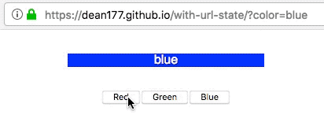

# with-url-state

[](https://circleci.com/gh/Dean177/with-url-state)
[](https://greenkeeper.io/)
[](https://www.npmjs.com/package/with-url-state)

Lifts state out of a react component and into the url



## Installation

`yarn add with-url-state` or `npm install with-url-state --save` if using npm

## Usage

Check out the [demo](https://dean177.github.io/with-url-state/), the [example/](https://github.com/Dean177/with-url-state/tree/master/example) directory, or play with it in [CodeSandbox](https://codesandbox.io/s/wwlz40ry65).

Using javascript

```javascript
import { createBrowserHistory } from 'history';
import React from 'react';
import { withUrlState } from 'with-url-state';

const history = createBrowserHistory();

export const UrlForm = (props) => (
  <div className="UrlForm">
    <div className="current-state" style={{ backgroundColor: props.urlState.color}}>
      <div>{props.urlState.color}</div>
    </div>
    <div className="color-buttons">
      <button className="Red" onClick={() => props.setUrlState({ color: 'red' })}>
        Red
      </button>
      <button className="Green" onClick={() => props.setUrlState({ color: 'green' })}>
        Green
      </button>
      <button className="Blue" onClick={() => props.setUrlState({ color: 'blue' })}>
        Blue
      </button>
    </div>
  </div>
);

export default withUrlState(history, (props) => ({ color: 'blue' }))(UrlForm);
```

Using typescript

```typescript
import { createBrowserHistory } from 'history';
import * as React from 'react';
import { withUrlState, UrlStateProps } from 'with-url-state';

const history = createBrowserHistory();

type OwnProps = {};
type LiftedState = { color: string };

export const UrlForm = (props: OwnProps & UrlStateProps<LiftedState>) => (
  <div className="UrlForm">
    <div className="current-state" style={{ backgroundColor: props.urlState.color}}>
      <div>{props.urlState.color}</div>
    </div>
    <div className="color-buttons">
      <button className="Red" onClick={() => props.setUrlState({ color: 'red' })}>
        Red
      </button>
      <button className="Green" onClick={() => props.setUrlState({ color: 'green' })}>
        Green
      </button>
      <button className="Blue" onClick={() => props.setUrlState({ color: 'blue' })}>
        Blue
      </button>
    </div>
  </div>
);

export default withUrlState<OwnProps, LiftedState>(history, (prop: OwnProps) => ({ color: 'blue' }))(UrlForm);

```

## Motivation

Being able to have a sharable link which captures the state of a page can be very useful functionality for users.

This commonly occurs when viewing search results, filtering or querying over a data set or even tracking the currently visible portion on a map.

The api provided is:
- based on [higer-order-components](https://reactjs.org/docs/higher-order-components.html) which makes it composable and testable
- type-safe thanks to [Typescript](https://www.typescriptlang.org/)   
- very similar to [Reacts built in state](https://reactjs.org/docs/state-and-lifecycle.html) apis, so converting a component which already manages state is usually as simple as replacing `setState` with `setUrlState`!
